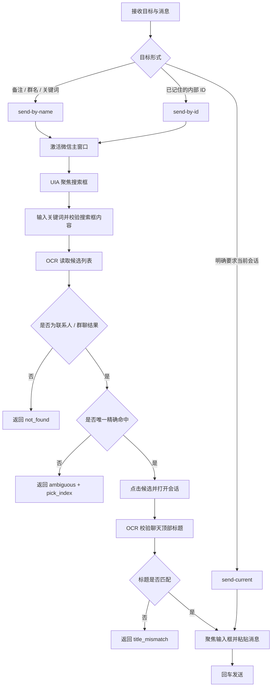
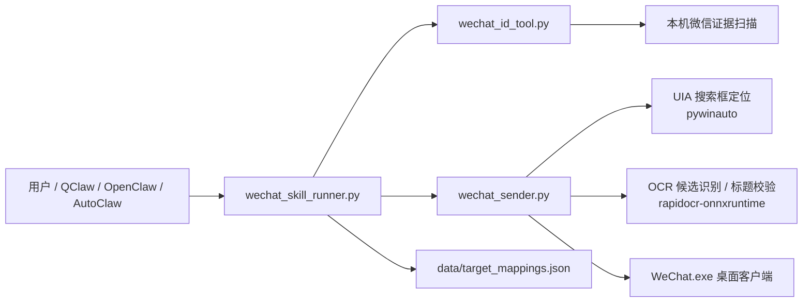

# WeChat Message Send Skill

一个适用于 Windows 个人微信桌面版的本地技能包。

它把下面这条完整链路封装成了可导入的 `skills`：

1. 扫描本机微信证据，提取 `wxid_*` 和 `*@chatroom`
2. 按群名、备注、关键词查找候选 ID
3. 按特征搜索微信会话，并在必要时要求用户二次确认
4. 记住稳定的 `目标ID -> 搜索关键词` 映射
5. 通过微信桌面客户端 UI 自动化把消息发到正确目标

这个仓库适合发布到 GitHub，也适合直接导入 `QClaw`、`OpenClaw`、`AutoClaw` 一类支持本地技能目录的宿主。

## 特性

- 只读扫描，不做数据库解密
- 支持提取 `wxid_*` 与 `*@chatroom`
- 支持按关键词、备注、群名搜索会话或 ID
- 支持按名字/备注/群名发送消息
- 支持按已记住的内部 ID 发送消息
- 默认走更稳的微信桌面 UI 自动化，不做注入
- 优先通过 UIA 聚焦微信搜索框，再做 OCR 候选识别
- 打开聊天后会校验顶部标题，不匹配就终止，避免误发到当前停留会话
- 多个候选时返回 `ambiguous`，不会静默猜测发送对象
- 会过滤微信“网络搜索结果”等非联系人面板，未命中时返回 `not_found`
- 已做去敏处理，仓库不内置真实联系人、真实群名、真实 chatroom id

## 仓库结构

- [wechat-message-send](./wechat-message-send)
  可直接导入的技能目录
- [wechat-message-send/SKILL.md](./wechat-message-send/SKILL.md)
  技能入口说明
- [wechat-message-send/README.md](./wechat-message-send/README.md)
  技能包内说明
- [wechat-message-send/scripts/wechat_skill_runner.py](./wechat-message-send/scripts/wechat_skill_runner.py)
  统一入口
- [wechat-message-send/scripts/wechat_id_tool.py](./wechat-message-send/scripts/wechat_id_tool.py)
  ID 扫描与查询
- [wechat-message-send/scripts/wechat_sender.py](./wechat-message-send/scripts/wechat_sender.py)
  稳定发送器
- [wechat-message-send/data/target_mappings.json](./wechat-message-send/data/target_mappings.json)
  映射模板

## 环境要求

- Windows
- Python 3.10+
- 已安装并登录个人微信桌面版
- 微信窗口可被正常切到前台
- 推荐在桌面会话中运行，不要通过无人值守后台会话执行

运行发送命令时，脚本会自动尝试安装缺失依赖：

- `pywinauto`
- `rapidocr-onnxruntime`

如果宿主禁用了自动安装或首跑时没有网络，请手动安装：

```powershell
python -m pip install -U pywinauto rapidocr-onnxruntime
```

## 使用前注意事项

- 仅适用于个人微信桌面版，不是企业微信、网页版微信或协议注入方案
- 首次运行发送功能时，建议先手动打开并登录微信，再让技能接管
- 发送过程中会抢占微信窗口、键盘和鼠标焦点，期间不要手动切窗口或移动鼠标
- 中文消息建议统一写入 UTF-8 文本文件后再用 `--message-file`
- 如果宿主环境无法联网，最好先手动安装依赖后再导入技能
- 如果命中多个候选，会返回 `ambiguous` 和 `pick_index`，此时应先让用户确认，不要猜测
- 如果标题校验失败，会返回 `title_mismatch`，此时应视为未发送
- 发布到 GitHub 前，保持 `wechat-message-send/data/target_mappings.json` 为空模板，不要提交本地扫描产物

## 发布前检查

- `target_mappings.json` 保持为空对象 `{}`
- 不提交 `data/out/`、调试截图、临时消息文件和个人测试结果
- README 中只保留占位符，不保留真实备注、真实群名、真实 chatroom id
- 在另一台机器使用前，先确认 Python 与微信路径是本机实际路径
- 建议附上 `wechat-message-send.zip`，方便直接导入宿主

## 导入方式

如果宿主支持导入本地文件夹，直接导入：

- `wechat-message-send`

如果宿主支持 zip 导入，使用：

- `wechat-message-send.zip`

## 快速开始

先准备一条 UTF-8 消息文件：

```powershell
@'
from pathlib import Path
Path(r'.\wechat-message-send\data\message.txt').write_text('你好', encoding='utf-8')
'@ | python -
```

按名字、备注或群名发送：

```powershell
python .\wechat-message-send\scripts\wechat_skill_runner.py send-by-name --keyword "<联系人备注或群名>" --message-file .\wechat-message-send\data\message.txt --wechat-path "<你的WeChat.exe路径>"
```

如果你已经知道内部 ID，先记住它对应的搜索关键词：

```powershell
python .\wechat-message-send\scripts\wechat_skill_runner.py remember --id "<chatroom-id或wxid>" --keyword "<联系人备注或群名>"
```

然后按内部 ID 发送：

```powershell
python .\wechat-message-send\scripts\wechat_skill_runner.py send-by-id --ids "<chatroom-id或wxid>" --message-file .\wechat-message-send\data\message.txt --wechat-path "<你的WeChat.exe路径>"
```

## 稳定发送链路

`send-by-name` 与 `send-by-id` 的实际发送流程是：

1. 激活微信主窗口
2. 聚焦左上角搜索框
3. 输入关键词并校验搜索框内容
4. OCR 读取候选列表
5. 若无匹配则返回 `not_found`
6. 若多条匹配则返回 `ambiguous` 与 `pick_index`
7. 点击候选后再校验聊天顶部标题
8. 标题匹配时才粘贴消息并回车发送

这意味着它不会直接把消息发到“当前停留的聊天窗口”，除非你显式使用 `send-current`。

## 设计思想

这个技能的核心目标不是“最快发出去”，而是“尽可能别发错人”。

- 安全优先：宁可返回 `ambiguous`、`not_found`、`title_mismatch`，也不静默误发
- 人类特征优先：优先按备注、群名、关键词找会话，而不是假设用户总能提供内部 ID
- 多重校验：搜索框内容校验、候选列表识别、顶部标题校验三层保护
- 失败即停止：任何关键步骤不确定，都直接停止，不进入发送动作
- 可分享：仓库默认不带真实目标信息，发给朋友后也能直接导入使用

## 发送流程图



## 模块设计图



## 常用命令

扫描本机微信 ID：

```powershell
python .\wechat-message-send\scripts\wechat_skill_runner.py scan --wechat-path "<你的WeChat.exe路径>"
```

按关键词查找：

```powershell
python .\wechat-message-send\scripts\wechat_skill_runner.py find "<群名关键词>" --kind chatroom
python .\wechat-message-send\scripts\wechat_skill_runner.py find "<联系人备注>"
```

只做演练，不真正发送：

```powershell
python .\wechat-message-send\scripts\wechat_skill_runner.py send-by-name --keyword "<联系人备注或群名>" --message-file .\wechat-message-send\data\message.txt --wechat-path "<你的WeChat.exe路径>" --dry-run
```

## QClaw 提示词示例

推荐把目标、消息内容和执行方式写清楚。

最短可用版本：

```text
使用 wechat-message-send 技能，给备注“目标备注”的微信发送消息“你好”。
```

更稳的版本：

```text
调用 wechat-message-send：
1. 使用微信桌面客户端的稳定 UI 自动化方案
2. 按备注“目标备注”搜索会话
3. 只有在搜索结果唯一且聊天标题校验通过时才发送“你好”
4. 如果出现多个候选，就把候选和 pick_index 告诉我，不要猜测发送对象
5. 执行后告诉我是否已发送
```

先查 ID，再记住，再发：

```text
使用 wechat-message-send 技能，先查找群名关键词“项目通知群”的 chatroom id；找到后把这个 id 和记为“项目通知群”；然后向它发送“你好”。
```

已记过映射后的简化版本：

```text
使用 wechat-message-send 技能，给已记住的目标“项目通知群”发送消息“你好”。
```

## OpenClaw / AutoClaw 通用提示词

```text
使用 wechat-message-send 技能，通过微信桌面客户端给“目标备注”发送消息“你好”。如果没有内部 ID，就直接按备注搜索；如果已经记过映射，就优先按已记住的目标发送；如果搜索结果不唯一，就先让我确认 pick_index。
```

## 设计说明

- 发送能力基于 UI 自动化
- `send-by-name` 适合自然语言请求，例如“给某某某发消息”
- `send-by-id` 适合已有稳定映射的场景
- `send-current` 只适合“给当前打开的聊天发”
- 中文消息建议优先走 `--message-file`，避免终端编码问题
- 搜索框优先通过 UIA `Edit(title="搜索")` 聚焦
- 候选列表与聊天顶部标题通过 OCR 校验
- 微信网络搜索面板不会被当成联系人候选
- 标题校验失败时会返回 `title_mismatch`，不会继续发送

## 安全与隐私

- 本仓库不包含真实联系人、真实群名、真实 chatroom id
- `target_mappings.json` 发布版为 `{}` 空模板
- `out/` 目录属于本地扫描产物，不建议提交到公开仓库
- 使用前请确认目标会话搜索结果唯一，避免误发

## 已验证内容

- 技能包可独立运行
- 单元测试 `python -m unittest tests.test_wechat_sender tests.test_wechat_skill_runner` 已通过
- `remember`、`send-by-name --dry-run`、`send-by-id --dry-run` 已验证
- 前台实机验证了“可解析目标”和“未找到目标”两条分支
- 真实发送链路已完成测试

## 注意事项

- 运行发送脚本时，程序会切换微信窗口并接管键盘/鼠标焦点
- 发送过程中不要手动操作电脑
- 该技能面向个人微信桌面版，不是企业微信方案
