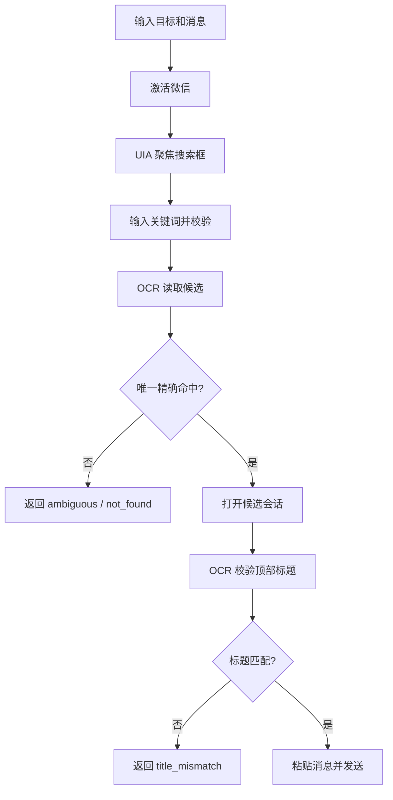

# WeChat Message Send Skill

这是一个可直接导入宿主的本地技能目录，适用于 Windows 个人微信桌面版。

## 能力

1. 扫描本机微信证据，提取 `wxid_*` 和 `*@chatroom`
2. 按关键词、备注、群名查找候选 ID
3. 记住 `目标ID -> 搜索关键词` 映射
4. 按名字、备注、群名发送消息
5. 按已记住的内部 ID 发送消息
6. 给当前打开的聊天发送消息

## 稳定性规则

- 默认使用 `send-by-name` 或 `send-by-id`
- 搜索框优先通过 UIA 聚焦，再做 OCR 候选识别
- 搜索结果多条时返回 `ambiguous`，不会猜测发送对象
- 微信网络搜索面板会被过滤，不会误判为联系人
- 打开聊天后会校验顶部标题，校验失败返回 `title_mismatch`
- 只有目标唯一且标题匹配时，才真正发送消息

## 目录

- `SKILL.md`
- `scripts/wechat_skill_runner.py`
- `scripts/wechat_id_tool.py`
- `scripts/wechat_sender.py`
- `data/target_mappings.json`

## 导入

如果宿主支持导入文件夹，直接导入这个 `wechat-message-send` 目录。

如果宿主支持 zip 导入，使用仓库根目录中的 `wechat-message-send.zip`。

脚本运行时会自动尝试安装缺失依赖：

- `pywinauto`
- `rapidocr-onnxruntime`

如果宿主禁用了自动安装或没有网络，可手动执行：

```powershell
python -m pip install -U pywinauto rapidocr-onnxruntime
```

## 使用注意事项

- 仅适用于 Windows 个人微信桌面版
- 发送前请确认微信已登录
- 运行时会接管微信焦点，不要手动操作键盘和鼠标
- 命中多个候选时应先让用户确认 `pick_index`
- 返回 `title_mismatch`、`not_found`、`ambiguous` 时都应视为未发送
- 中文消息优先使用 `--message-file`

## 示例

创建 UTF-8 消息文件：

```powershell
@'
from pathlib import Path
Path(r'.\data\message.txt').write_text('你好', encoding='utf-8')
'@ | python -
```

按名字发送：

```powershell
python .\scripts\wechat_skill_runner.py send-by-name --keyword "<联系人备注或群名>" --message-file .\data\message.txt --wechat-path "<你的WeChat.exe路径>"
```

若搜索结果多条，脚本退出码为 `3`，JSON 里会有 `ambiguous` 与各行的 `pick_index`。用户选定序号后，用同一关键词再加 `--pick-index N` 重试发送。

```powershell
python .\scripts\wechat_skill_runner.py send-by-name --keyword "<联系人备注或群名>" --pick-index 2 --message-file .\data\message.txt --wechat-path "<你的WeChat.exe路径>"
```

退出码：`0` 成功；`2` 异常；`3` 需用户处理（ambiguous / not_found / title_mismatch 等）。stdout 末行含 `skill_exit=ok` 或 `skill_exit=needs_user_action`。

按内部 ID 发送前先记映射：

```powershell
python .\scripts\wechat_skill_runner.py remember --id "<chatroom-id或wxid>" --keyword "<联系人备注或群名>"
```

## 设计思想

- 安全优先，不确定就不发送
- 优先按备注/群名/关键词定位真实会话
- 搜索框、候选列表、聊天标题三层校验
- 结果不唯一时让用户确认，不猜测发送对象



## QClaw 提示词

```text
使用 wechat-message-send 技能，给备注“目标备注”的微信发送消息“你好”。
```

```text
调用 wechat-message-send：
1. 按备注“目标备注”搜索会话
2. 只有在搜索结果唯一且聊天标题校验通过时才发送“你好”
3. 如果有多个候选，就把候选和 pick_index 列出来，不要猜测发送对象
4. 执行后告诉我是否已发送
```

```text
使用 wechat-message-send 技能，先查找群名关键词“项目通知群”的 chatroom id；找到后把这个 id 和记为“项目通知群”；然后向它发送“你好”。
```

## 说明

- 发布版不内置真实联系人、真实群名、真实 chatroom id
- `data/target_mappings.json` 是空模板，可安全分享
- 发送时会接管微信窗口焦点
- 建议优先使用 `--message-file` 传中文消息
- 不要把 `send-current` 当成“按关键词找人发送”的替代方案
